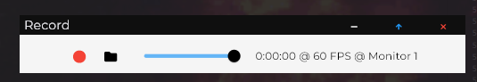
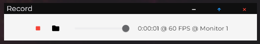

# Record

### **Overview**
Flet (Python implementation of Google's Flutter) app designed to record your primary monitor's screen. Includes audio and video.

Only works on Windows.

### **How To Use**
1) `git clone` this repo.
```
git clone https://github.com/Cuh4/record
```

2) Start the application using the following commands:
```
cd src
py main.py
```

3) Let the UI explain the rest.

### **Images**

